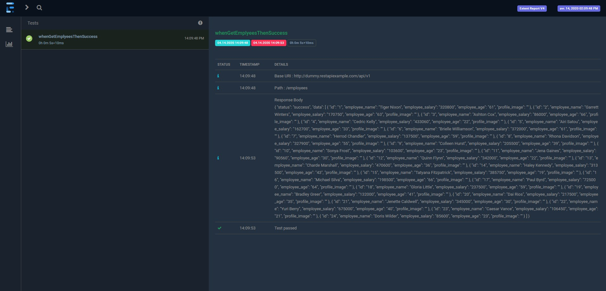
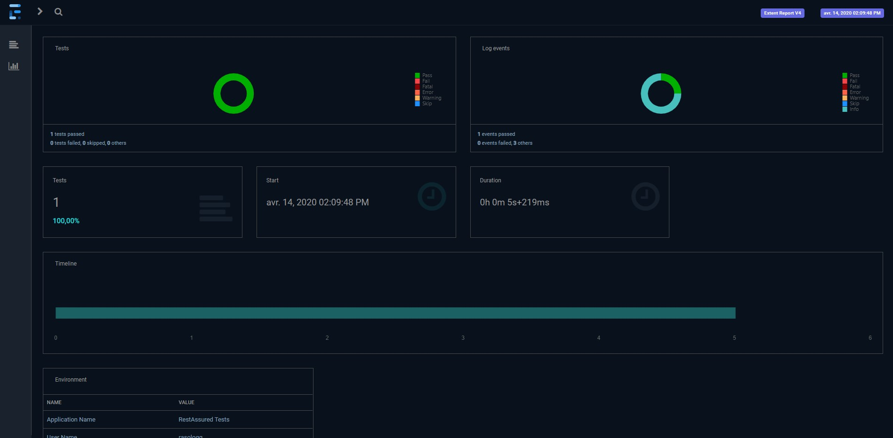

## Introduction
The aim of this tutorial is to show how generate a RestAssured report with https://extentreports.com/ 





## Maven

```xml
<dependency>
    <groupId>io.rest-assured</groupId>
    <artifactId>rest-assured</artifactId>
    <version>4.3.0</version>
    <scope>test</scope>
</dependency>
<dependency>
    <groupId>org.testng</groupId>
    <artifactId>testng</artifactId>
    <version>7.1.0</version>
</dependency>
<dependency>
    <groupId>com.aventstack</groupId>
    <artifactId>extentreports</artifactId>
    <version>4.1.4</version>
</dependency>
```

## Java code

### Some code to configure the framework

Read here: [ExtentManager.java](./src/test/java/io/rasologg/restassured/extentreports/ExtentManager.java)

Read here: [ExtentTestManager.java](./src/test/java/io/rasologg/restassured/extentreports/ExtentTestManager.java)


### Some TestNG listeners

Read here: [TestListener.java](./src/test/java/io/rasologg/restassured/listeners/TestListener.java)

### RestAssured example

Read here: [RestAssuredExample.java](./src/test/java/io/rasologg/restassured/test/RestAssuredExample.java)
